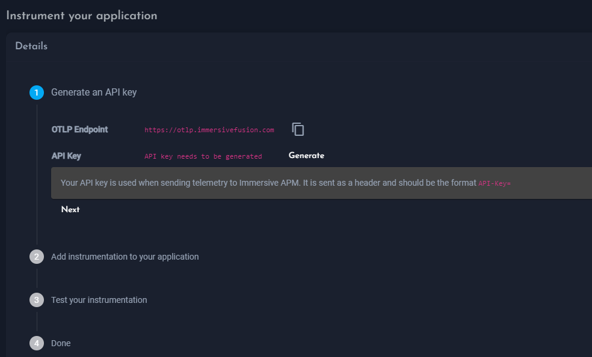

# Instrumentation

{!template/subscription-required.mdp!}

Immersive APM offers support for the [OpenTelemetry](../OpenTelemetry/index.md) [observability framework](../Observability/index.md). This is the most common and easiest configuration for customers to get started.

The process is called [instrumentation](https://opentelemetry.io/docs/instrumentation/) and [OpenTelemetry](../Observability/Frameworks/OpenTelemetry/index.md) provides an exhaustive amount of documentation for many mainstream programming languages. The process of instrumentation with OpenTelemetry involves adding the OpenTelemetry SDK to the application's codebase and configuring it to collect telemetry data. The SDK provides APIs to capture telemetry data from various sources in the application, including traces, metrics, and logs. Once the SDK is integrated into the application, developers can configure it to export the collected telemetry data to various tools and platforms, such as Immersive APM or other observability tools. The OpenTelemetry collector is a component that can be used to receive, process, and export telemetry data from the application.

After instrumentation is completed Immersive APM will start collecting telemetry data from the software application to gain insights into its performance, behavior, and usage. This data can then be seen in the [Immersive APM Web](../../../Analysis-&-Visualization/Web/index.md) and [Immersive APM 3D/VR](../../../Analysis-&-Visualization/3D-&-VR/index.md) clients. 

## Sending data to Immersive APM

Sending data to Immersive APM is easy! Configure your OTLP endpoint to `otlp.immersivefusion.com` and supply your API key.

### New Customers

If you haven't already, [start your subscription](https://www.immersivefusion.com/pricing){:target="myif"} by choosing the plan right for you. Then, follow the steps to configure your account:

1. [Create a new tenant](https://my.immersivefusion.com/admin/tenants){:target="myif"} ([What is this?](../getting-started/account/#tenant)) 
1. [Create a new billing profile](https://my.immersivefusion.com/admin/tenant-billing-profiles){:target="myif"} ([What is this?](../getting-started/account/#billing-profile)) 
1. [Create a new subscription](https://my.immersivefusion.com/admin/subscriptions){:target="myif"}  ([What is this?](../getting-started/account/#subscription)) 
1. [Create a new environment](https://my.immersivefusion.com/admin/environments){:target="myif"} ([What is this?](../getting-started/account/#environment)) 
1. [Create a new (application) grid](https://my.immersivefusion.com/admin/grids){:target="myif"} ([What is this?](../getting-started/account/#grid)) 

### Existing Customers

Once you have at least one grid created, click on the instrumentation button :gear:


Follow the wizard to create your application grid API key, instrument your application and test the instrumentation setup. If you application is already instrumented, you just need to take the API key. 

!!! warning "API keys are per Grid"
    Every application grid should have its own unique API key. Otherwise, trace/log data from two or more applications will be mixed together.



The final piece is to specify your OTLP endpoint and API key. The code to do so will look different based on the language your application is written in. Here's C# example. Supply the API key to your application and deploy it. That's it!

C# example:

```csharp
.AddOtlpExporter(o =>
{
    o.Endpoint = new Uri("https://otlp.iapm.app");// i.e. this.Configuration["IfApmOtlpEndpoint"]
    o.Headers = $"API-Key=IF-API-KEY-HERE";// i.e. {this.Configuration["IfApmAPIKey"]}
});
```

### Enter your grid

Once you have configured, deployed and tested your instrumentation, [Enter the World of Your Application &trade;](https://my.immersivefusion.com/apm/){:target="myif"} by either clicking the enter :material-login: button in [Immersive APM Web](../apm/web#immersive-apm-web) and [Immersive APM 3D/VR](../apm/3d#immersive-apm-3dvr) to start seeing your traces and log information.


## Summary

Instrumentation with the OpenTelemetry observability framework is a powerful tool for collecting telemetry data from software applications. It allows developers to use [Immersive APM Web](../apm/web#immersive-apm-web) and [Immersive APM 3D/VR](../apm/3d#immersive-apm-3dvr) clients and gain valuable insights into the application's performance, behavior, and usage, and make data-driven decisions to improve the application's functionality and user experience.
