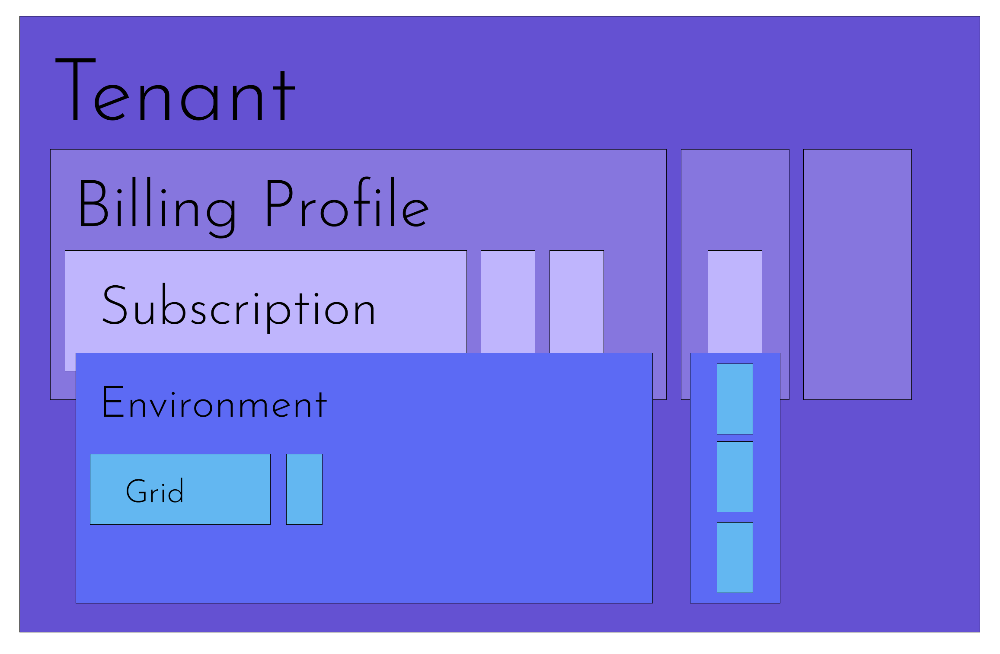

# Configure your account

{!template/subscription-management.mdp!}

## New Customers

If you haven't already, [start your subscription](https://www.immersivefusion.com/pricing){:target="myif"} by choosing the plan right for you. Then, follow the steps to configure your account:

1. Create a new tenant ([What is this?](#tenant)) 
1. Create a new billing profile ([What is this?](#billing-profile)) 
1. Create a new subscription ([What is this?](#subscription)) 

## All Customers

1. Create a new environment ([What is this?](#environment)) 
1. Create a new (application) grid ([What is this?](#grid)) 

## Account Components

### Customer Account

A customer account is a personalized space provided by Immersive Fusion to its customers, where they can subscribe to, join and access various features and services. A customer account typically requires customers to create a profile with their personal information, such as their name, email address, and sometimes billing information. 

### Tenant

Accounts can have one or more *tenants*. A tenant represents organizational structure that is meaningful to the customer such the company itself or a department that has monitored or managed resources. 

### Billing Profile

Tenants have an associated *billing profile* that is used to pay for services used. 

### Subscription

A subscription allows aggregated billing for services rendered for the customer. They are a common pricing model used by businesses to offer their products or services to customers. With a subscription plan, customers pay a recurring fee at regular intervals (usually monthly or annually) to access the product or service. Plans are structured in a variety of ways depending on the nature of the product, service quality and reliability being offered. 

For a list of current plans, [click here](https://immersivefusion.com/pricing)

### Environment

Managed resources for a tenant are organized by *environments*. Environments group different software applications based on their physical location, purpose or deployment designation. For example, applications in separate data centers or stages such as development and production. 

### Grid

Each managed application is a member of environment is referred to a *grid*.

# Are you ready?

[Get Started Today!](../../Getting-Started/index.md){:class="md-button md-button--primary"}

